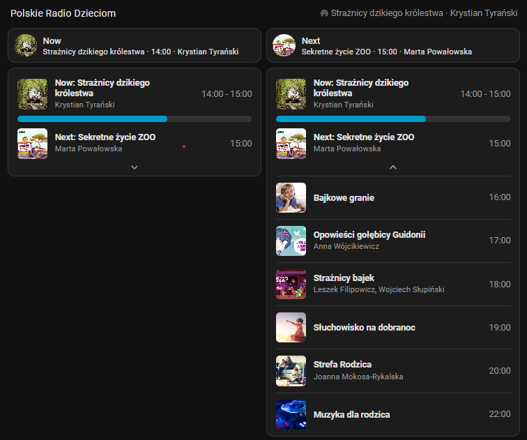

# Polskie Radio Dzieciom (Home Assistant)

Home Assistant custom integration and Lovelace card to display today's schedule for Polskie Radio Dzieciom.

## Showcase



- Fetches today's schedule from `https://apipr.polskieradio.pl/api/schedule?Program=11` with browser-like headers.
- Sensor `sensor.polskie_radio_dzieciom_schedule` holds the current item title, with attributes for current, next, and rest of day (including progress, remaining time, and formatted times).
- Lovelace card `prd-card` shows current programme with progress bar, next with start time, and an expandable list for the rest of the day.

## Install via HACS

1. In HACS, go to Integrations ➜ Custom repositories ➜ Add:
   - Repository: `https://github.com/seler/ha-prd`
   - Category: `Integration`
2. Install the repository. Restart Home Assistant.
3. Go to Settings ➜ Devices & services ➜ Add integration ➜ search for "Polskie Radio Dzieciom" and add it.
4. Frontend card (manual):
   - Copy `www/community/prd-card/prd-card.js` from this repository into your HA config at `/config/www/prd-card/prd-card.js` (create the folder if needed).
   - In Settings ➜ Dashboards ➜ Resources, add:
     - URL: `/local/prd-card/prd-card.js`
     - Type: `module`
   - If the card doesn't update after replacing the file, bump the resource URL with a version, e.g. `/local/prd-card/prd-card.js?v=2`, and hard-refresh the browser.

### Example card config

```yaml
- type: 'custom:prd-card'
  entity: sensor.polskie_radio_dzieciom_schedule
```

## Update

- In HACS, open the repo and click Update when available, then restart HA.
- If you manually installed, copy the updated `www/community/prd-card/prd-card.js` into `/config/www/prd-card/` and restart HA (or clear cache/bump the resource version).

## Troubleshooting

- Ensure the integration is loaded and the sensor exists. Check Developer Tools ➜ States.
- If attributes are empty, check HA logs for PRD messages; the site may have throttled requests. The integration sends typical browser headers.

## Development

Directory layout:

- `custom_components/prd/` — integration code (sensor + coordinator).
- `www/community/prd-card/` — Lovelace card.

## License

MIT
